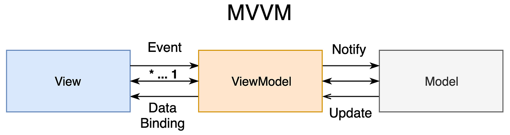

# NasaNews App

## Overview

NasaNews is an iOS application that showcases the grandeur of space through stunning imagery provided by the NASA API. It's designed to captivate and educate users with breathtaking space visuals and insightful information.

## Features

- **Image Gallery**: Browse through a collection of space images from NASA's extensive database.
- **Detailed Descriptions**: Each image comes with a detailed description, allowing users to learn more about what they're viewing.
- **Latest News**: Stay up-to-date with the most recent developments in space exploration and research.

## Architecture

This application is structured following the Model-View-ViewModel (MVVM) pattern to ensure clean separation of logic and presentation. This approach enhances the maintainability and scalability of the codebase.

### MVVM Diagram

### Folder Structure

- `Model`: Contains domain data and business logic.
- `View`: Handles the presentation layer and user interface components.
- `ViewModel`: Acts as the intermediary between the Model and the View, processing user actions and updating the View.
- `Network`: Manages all network-related operations, including API requests and responses.
- `Database`: Handles local persistence, providing offline support and data caching.
- `Helpers`: Includes utility classes and extensions used throughout the app.

## Installation

To run the NasaNews app:

1. Clone the repository.
2. Open `NasaNews.xcodeproj` in Xcode.
3. Build and run the application on your preferred iOS device or simulator.

## Usage

Upon launching, the app presents a list of images. Users can select any image to view its details, including a high-resolution version and descriptive content.

## Contributing

We welcome contributions to the NasaNews app. If you have suggestions or want to improve the codebase, please feel free to fork the repository and submit a pull request.

## License

This project is licensed under the MIT License - see the [LICENSE.md](LICENSE.md) file for details.

## Acknowledgements

- Thanks to NASA for providing a public API with a wealth of information on space and celestial bodies.
- Appreciation for all contributors and testers who have helped refine the NasaNews app.
